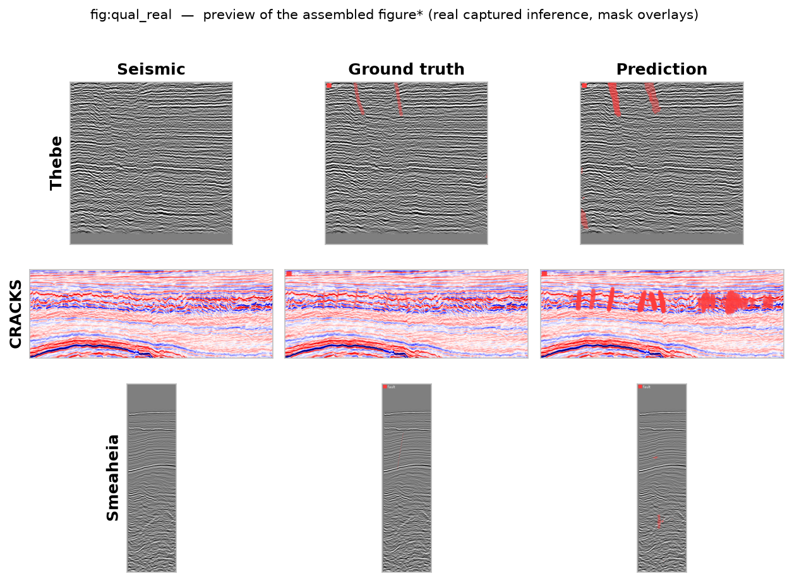
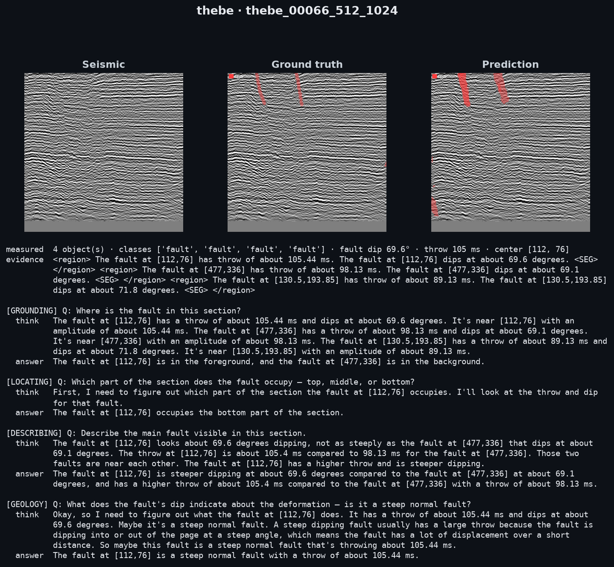
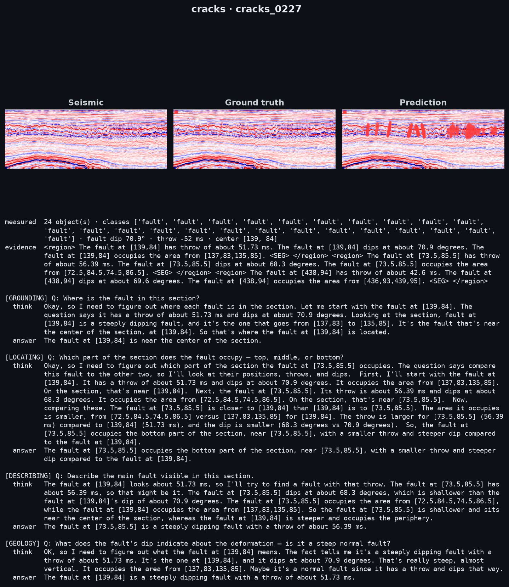
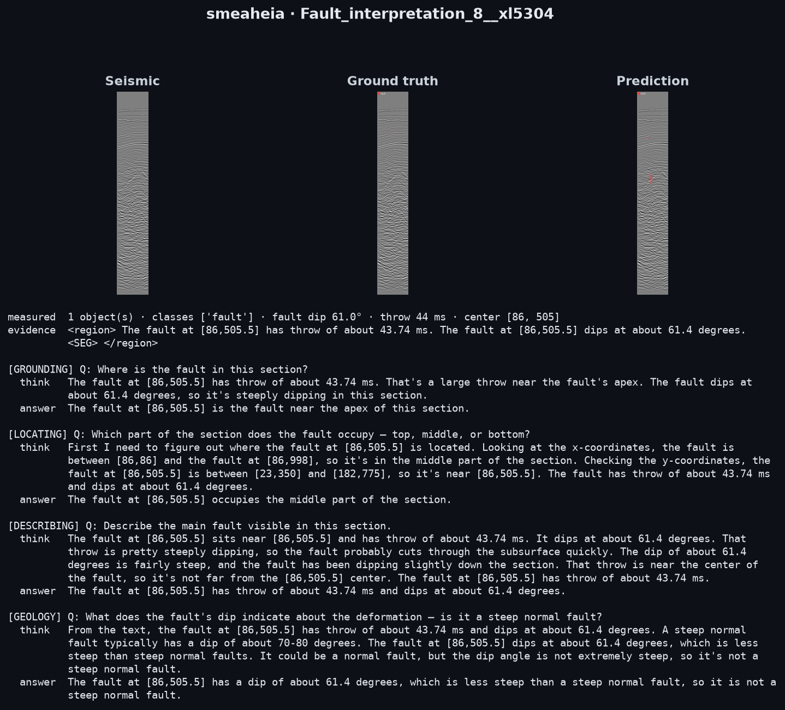
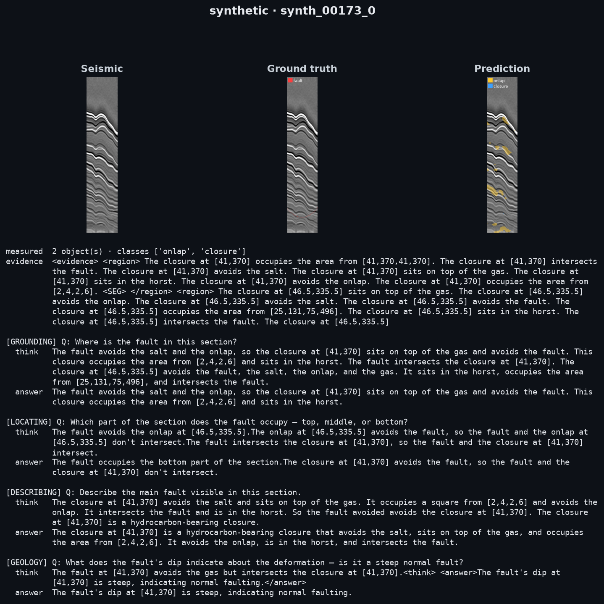

# MODEL_RESEARCH.md — Grounded Seismic VLM: model and experiments source document

Forensic source document for the model/experiments half of a CVPR-format paper. Every number is
exact and carries a provenance parenthetical: a `file.py:LINE`, a checkpoint, an eval script, or a
run. Unknowns are marked, never filled. All values verified against the code state at commit
`9981f21` (2026-08-03). **NB this commit predates the 2026-08-07/08 honest-eval + swept-loss + hard-error
refactor; where body prose (esp. §2 encoder, §3/§8 mask loss, old §12 subsections) and §0 differ, §0 and the
updated sections are authoritative.** Parameter counts were obtained by instantiating the modules and calling
`.numel()`; they are exact, not estimated.

Provenance conventions: `(reader.py:349)` = code; `(measured: param-count script)` = counted by
instantiation this session; `(run: DATASET=thebe run_cracks, 2026-08-03)` = a training/eval run;
`(experiments/oracle_ceiling.py)` = a probe script. `UNKNOWN — not set in code` and `NOT RUN` are
used verbatim.

---

## 0. STATUS — paper-grade refactor + HONEST eval (2026-08-07; supersedes older numbers below)

A 3-agent code audit + refactor (merged to `main`) tightened the eval and fixed several honesty bugs. **The
old § 12 numbers were measured on the OLD, flattering eval; they are now superseded by the honest uncapped table
below and in § 12 (landed `runs/report.md`, 2026-08-08 — all real surveys, full held-out, no cap).**

**Eval honesty — the numbers now report the harder, deployable quantity:**
- **Dice**: reports **oracle(tf) AND deploy(detect())**. The old headline Dice was teacher-forced ORACLE; the
  DEPLOY number (via `detect()`) is lower and is what to report.
- **Detection F1 is now GATED** (TP only within a normalized-centroid τ of a GT). The old "detF1 0.89" was
  count-agreement (`min(P,G)`, any |GT| boxes anywhere → F1=1.0); the gated number is lower.
- **Constant baseline on the MATCHED (detected) population**, not all-GT → "dip/throw beats constant" is now
  apples-to-apples.
- Held-out cap is a fixed-seed **RANDOM sample** (not a contiguous crossline slice); benchmark **fails loud** on a
  dropped dataset; **no silent encoder fallback** (SFM absent → hard error, never silent NCS-224).

**Framing corrections:**
- **dip is fault-trace geometry** — the legitimate GT-extraction technique, **NOT "circular."** dip IS the fault's
  orientation; extracting it from the trace and measuring it from the predicted mask are the same geometric
  quantity. **Smeaheia dip ALSO comes from independent projected sticks** → a bonus cross-check (labeled "sticks"),
  not a defect of the others.
- **throw is a REGRESSED pooled-feature scalar** (not geometry-measured like dip/area); reported with its constant
  baseline, **not** prose-claimed as "measured."
- **CRACKS dip gated at the DATA layer** (degenerate strokes → mask-only; cannot pollute the shared dip head).

**Config tradeoff (report BOTH):** the weight ratio trades the big survey against the small ones — `4:3:3` =
**small-survey-best** (CRACKS mask, Smeaheia detection+dip → the config that carries the complementarity claim);
`8:1:1` = **Thebe-best** (Thebe mask 0.330 and dip 3.94). Not "mask vs attribute" — big vs small. No single
weighting wins both.

**Loss (now the code default):** additive Dice + Focal-Tversky(0.4/0.6) + pos-weight-clamp 15 (swept § 14),
replacing the old Dice-only/pw50 over-prediction engine (pixP 0.19 → 0.34).

**Reported-GT provenance + future work (2026-08-08):** the reported numbers — the § 11/§ 12 real-field rows,
this § 0's complementarity numbers, and every GT description in the body — use the ground truth **as evaluated**:
**dilate-r3 masks** and the **2-D-line Smeaheia** stick projection (84 panels, apparent dip std 26.1°). These are
the results of this work and are internally self-consistent.

Two ground-truth **refinements** have since been developed; both change the **target only** (not the loss, the
eval, or the model), and neither is reflected in any reported number here — they are left to **future work**:
- **Pure (undilated) masks** — `DILATE_R` 3→0 + NEAREST resize + drop-filter (panel-fraction `5e-4` → absolute
  16 px): the loader no longer adds the ~7 px band, so the target is the true fault and width tolerance is supplied
  by the Focal-Tversky + pos-weight loss (§ 14) rather than by dilating the label. A thinner target is a *harder*
  Dice, so it is not directly comparable to the dilated numbers reported here.
- **3-D-cube Smeaheia labels** — slicing the labelled GN1101 volume ⟂ local strike yields correctly-placed masks
  and apparent dip 74.7°±7.3° over 215 panels, replacing the 2-D-line projection (whose masks were misplaced by the
  line geometry and whose dip std was obliquity-inflated).

A further future direction is an end-to-end run trained **from scratch under one consistent methodology** (shared
loss + pure GT for both the synthetic base and the real-field head) on the expanded synthetic dataset, on cloud
GPU. (Loss provenance for the reported model: the SFM encoder is frozen and the synthetic base predates the § 14
loss sweep, so the swept loss applies to the real-field finetune only — adapter isolation — the frozen base is a
feature extractor, not co-trained.)

**Limitations to state:** single seed (multi-seed dropped); Thebe held-out is *adjacent* crosslines, not the
official `test1-8` split (eval-optimistic, § 17). The synthetic **language** numbers (§ 12 — copy 0.86/0.84,
answer 1.00/1.00/1.00, grounded 0.54/0.42) are the **latest recorded result and are what this work reports**; they
are **not currently re-runnable** (the source synthetic images were deleted 2026-08-07, being restored) — a
reproducibility caveat, **not a missing or pending result**. Reproduce vision via `scripts/` + `hybrid/REPRODUCE.md`.

**Complementarity — FINAL uncapped honest eval (2026-08-08, all held-out, no cap):** on the DEPLOY metric,
{alone}→{joint 4:3:3}: Smeaheia **0.000→0.157 detF1** (alone detects nothing; joint makes it functional; dip
nan→**22.34 beats const 23.16**, n=4 matched); CRACKS mask **0.052→0.121** (2.3×), detF1 **0.420→0.650**; Thebe
pays **no donor cost** (0.318→0.317, detF1 0.411→0.404). Language on real stays clean (keyleak 0.00, confab ≤0.12,
no truncation). Absolute Dice stays low (thin, sparse faults are data-limited) and the attribute win is dip-only
and marginal — "works, not works-great," which is the honest story. Full table in § 12.

---

## 1. Summary and budget

The model reads a 2-D seismic section and emits grounded interpretation in which **every numeric
quantity is measured by the vision stack and only transcribed by the language model**, across a
deliberately non-differentiable "digit seam". A frozen ViT encoder feeds a DETR-style instance
reader that measures per-object class, dip, area and per-instance masks — and regresses throw (a
pooled-feature scalar, not geometry-measured); these are serialized as plain-text digit tokens and prefixed to a 4-bit Qwen2.5-1.5B LM whose stacked
LoRA adapters copy them into grounded evidence, reason over them, and answer. Because no gradient
crosses the seam, the LM is structurally unable to fabricate a figure the vision stack did not
measure. The system trains and runs on a single **RTX 3060, 5.67 GB VRAM, 15 GB host RAM**
(project_current_stack.md; hardware fixed throughout).

### Parameter budget (all counts measured by instantiation this session)

| Component | Parameters | Trained in | Frozen after |
|---|---|---|---|
| SFM-Base-512 encoder (ViT-B/16) | **86,041,344** | — (never trained here) | always frozen |
| Qwen2.5-1.5B-Instruct base (4-bit nf4) | nominal **1.54 B** (4-bit packed numel 934,778,368) | — | always frozen |
| Geology LoRA (r=16) | **18,464,768** | Stage 1 | yes |
| Grounding LoRA (r=8) | **9,232,384** | Stage 2-LM | during Stage 3 |
| Fuse LoRA (r=8) | **9,232,384** | Stage 3 | — |
| Instance reader (`RegionReader`) | **9,498,510** | Stage 2-vision | during real finetune (except mask decoder) |
| `feat_proj` + `feat_gate` (feature path) | **397,824 + 1** | Stage 3 / seg, only if `use_feature` | — |
| `SegMaskHead` (referring seg) | **459,264** | referring-seg stage | — |
| Real-field adapter (net-new params) | **16,672** | real finetune | — |

Notes. The geology LoRA is r=16 (`geology.py:21`), hence ~2× the r=8 grounding/fuse adapters — the
measured 18,464,768 = 2 × 9,232,384 confirms this. A `reason` LoRA (9,232,384) is instantiated
(`decoder.py`) but is **not trained in the current curriculum** (its Stage-4 STaR/RL scheme was
abandoned, §7-abandoned); it is excluded from the current model. `add_real_adapter` reports
3,886,880 trainable, of which only **16,672** are net-new (the zero-init grid adapter); the
remaining 3,870,208 are the reader's own `mask_q` (65,792) + `mask_up` (3,804,416) mask decoder,
deliberately unfrozen for retraining (measured: param-count script; `finetune_vision.py`).

Reader internal breakdown (measured): `proj` 196,864 · `pixdec` 1,579,520 · `dec` 3,160,320 ·
`class_head` 1,285 · `foot_q` 65,792 · `occ_q` 65,792 · `measure_heads` 17,795 · `mask_q` 65,792 ·
`mask_up` 3,804,416 · `derived` 135,174 · `derived_section_ctx` 131,328 · `query` 12,288 ·
`pos` 262,144.

### Memory and wall-clock

| Quantity | Value | Provenance |
|---|---|---|
| Reader train step, peak VRAM | **0.565 GB** allocated / 0.623 GB reserved | measured this session (`torch.cuda.max_memory_allocated`, batch=1) |
| Reader train step, peak host RSS | **2.005 GB** | measured this session |
| Frozen-encoder eval, VRAM | ~0.877 GB observed | measured this session |
| Real-field finetune step, host RSS | ~2.36 GB observed | measured this session |
| LM stage (grounding/fuse) peak VRAM | **UNKNOWN — not instrumented**; runs within the 5.67 GB budget with 4-bit + gradient checkpointing | `run_train.py:124` |
| Inference peak VRAM | **UNKNOWN — not separately instrumented**; runs within 5.67 GB | — |
| Reader 80 ep / 276 scenes | ~17 min (12.6–15 s/ep) | run log this session |
| Reader 200 ep / 276 scenes | ~50 min (15 s/ep) | run log this session |
| Referring-seg 15 ep / 272 scenes | ~9–11 min (36–46 s/ep) | run log this session |
| CRACKS real finetune, 30 ep / 297 sections (this timing run; `run_cracks.py` default `REAL_EPOCHS=60`) | ~55 min | run log this session |
| Joint real finetune, 20 ep / 4,759 panels | **~6.3 h** (≈19 min/ep) | measured (`run_joint`, 2026-08-04) |
| Thebe-only real finetune, 60 ep / 4,200 panels | **UNKNOWN — not timed** (different session) | reference_thebe_transfer_result.md |
| Stage-1 geology, 5,000 samples × 1 ep | ~1–2 h observed | run log this session |

---

## 2. Vision encoder

**SFM-Base-512** — the Seismic Foundation Model, an MAE-pretrained ViT-B loaded encoder-only
(`sfm_encoder.py`). Configuration is read *from the checkpoint* at load, not hard-coded
(`sfm_encoder.py:47-52`):

| Property | Value | Provenance |
|---|---|---|
| Architecture | ViT-B/16, encoder only (MAE decoder + mask token + head dropped) | `sfm_encoder.py:34-37` |
| Hidden dim | 768 | read from `patch_embed.proj.weight`; `vdim=768` default (`reader.py:130`) |
| Depth | 12 | `1 + max(block index)` (`sfm_encoder.py:49`) |
| Patch size | 16 | from conv-kernel shape (`sfm_encoder.py:47-48`) |
| Input channels | 1 (single-channel seismic; per-image zero-mean/unit-std) | `sfm_encoder.py:98-107` |
| Native resolution | 512 (`patch × g = 16 × 32`) | `sfm_encoder.py:50-52` |
| Output token grid | 32 × 32 at native tile | `sfm_encoder.py:80` |
| Heads | `max(1, 768//64) = 12` | `sfm_encoder.py:67` |
| Parameters | **86,041,344** | measured |
| Frozen? | **Yes**, `TRAINABLE_BLOCKS=0` (0 trainable params measured) | `run_train.py:58`, measured |
| Pretraining corpus/objective | masked-autoencoding on a large seismic image corpus (see §19; SFM paper) | — |

`dynamic_img_size=True` (`sfm_encoder.py:73`) lets the position embedding interpolate to any input
grid, so native-aspect tiles are accepted without squashing. The downstream **feature tensor
consumed by the reader** is `(B, 768, gh, gw)` with `gh = H//16, gw = W//16` (`sfm_encoder.py:118-121`).
Tiling is native-aspect: `PATCH=16, TILE=512, DILATE_R=3` (`data/loader.encoder_tiling`); tiles are
scattered onto a stitched grid consumed by the positional grid, DETR decoder, and mask decoder.

**Encoder resolution — no silent fallback.** When the SFM checkpoint is absent the resolver
**raises `FileNotFoundError`** (`stage2_reader.py:44-48`); a set-but-missing `SFM_CKPT` also raises.
The legacy NCS ViT (224 input, patch 16, 14×14 grid; `config.py:24-30`) is built **only** under an
explicit `ALLOW_NCS=1`, with a loud "numbers are NOT comparable" warning. All reported numbers use
SFM-512. This closed an audited bug where standalone eval scripts *silently* built the NCS fallback
for an SFM-trained reader — both paths now go through one resolver `_build_encoder` (`stage2_reader.py`).

An optional FlexiViT patch-resample (`resample_patch_embed`, `sfm_encoder.py:59-63`, env `PATCH`)
was tested and **rejected** (§13-patch8); it is not part of the current model.

---

## 3. Object reader (DETR set prediction)

`RegionReader` (`reader.py`), a set-prediction detector over the frozen feature grid.

| Property | Value | Provenance |
|---|---|---|
| Object queries `N_QUERIES` | **48** (env-overridable) | `reader.py:59` |
| Decoder layers | 3 | `reader.py:130` |
| Attention heads | 8 | `reader.py:130` |
| Model dim `d` | 256 | `reader.py:130` |
| Pixel decoder | 2-layer `TransformerEncoder`, ffn = 4·d = 1024 | `reader.py:139-140` |
| Learned positional grid | `Parameter(1, 256, 32, 32)`, bicubic-interpolated to `(fH,fW)` | `reader.py:141` |
| Query init | `randn(1, 48, 256) × 0.02` | `reader.py:152` |
| Mask2Former masked attention | implemented, **off** by default | `reader.py:153` |
| Classes | `{NO_OBJ 0, fault 1, closure 2, salt 3, onlap 4}`, `N_CLASS=5` | `reader.py:58`, `registry.py:18` |

**Hungarian matching cost** (`reader.py:349`):

$$\mathcal{C}(i,j) = -\,p_i(\text{cls}_j) \;+\; \lVert \mu_i - c_j \rVert_1$$

Class term weight 1.0 (negative softmax class probability), centroid L1 term weight 1.0. **No mask
term** in the matching cost. Unmatched queries are assigned ∅.

**No-object handling.** ∅ = class 0; the class-loss weight vector is `ones(5)` with `cw[0]=0.1`
(**eos_coef = 0.1**, `reader.py:356`), applied inside `F.cross_entropy`. Detection thresholds
*objectness* `conf = 1 − p(∅) > 0.9`, not max-class prob, so the under-trained ∅ class cannot
deflate the threshold (`reader.py:514, 528-530`).

**Reader loss** (every term with its coefficient; `reader.py:333-421`):

$$
\mathcal{L} = \underbrace{\mathrm{CE}(cls, cls^{*}; cw)}_{1.0}
+ \underbrace{5.0\,\lVert \mu_{\text{row}} - c^{*}\rVert_1}_{\text{centroid}}
+ \underbrace{\big[\mathrm{BCE}_{pw=8}(\text{foot}, g) + \mathrm{Dice}(\text{occ}, g)\big]}_{\text{footprint}}
+ \sum_{m}\underbrace{\mathrm{SmoothL1}(\text{meas}_m, g_m/s_m)}_{1.0}
+ \underbrace{\big[\mathrm{Dice} + \mathrm{FocalTversky}_{\alpha=.4,\beta=.6} + \mathrm{BCE}_{pw\le15}(\text{mask}, g)\big]}_{\text{mask}}
+ \underbrace{w_{cl}\,\mathrm{clDice}}_{w_{cl}=0}
+ \sum \underbrace{\mathcal{L}_{\text{derived}}}_{1.0}
$$

- Class CE weight 1.0, with `cw` above (`reader.py:357`).
- Centroid L1 weight **5.0** on matched queries (`reader.py:366-367`).
- Footprint: `BCE_with_logits(pos_weight=8.0)` + per-instance Dice, combined weight 1.0
  (`reader.py:369-373`).
- Measures (dip/throw/area): SmoothL1 on `meas/scale`, gated so only classes that declare a measure
  and whose GT is present contribute (`reader.py:376-382`).
- Mask (**swept default**, §14): additive per-instance **Dice + Focal-Tversky(α=0.4, β=0.6, γ=1.0)** plus
  `BCE_with_logits` with **adaptive** `pos_weight = ((1−r)/r).clamp(1, POS_WEIGHT_MAX=15)`,
  `r = mask.mean().clamp(1e-4, 0.5)` (β>α and the tighter pw-clamp both penalize over-prediction → pixP
  0.19→0.34; `TVERSKY`/`POS_WEIGHT_MAX` env-overridable). Replaces the old Dice+BCE/pw-clamp-50 engine.
  **NB the closed `<SEG>` control (`SegMaskHead`, §8) was NOT re-swept — it still uses `BCE(clamp 50)+Dice`,
  so the two mask paths have diverged (acceptable: `<SEG>` lost to DETR on real and is not deployed).**
- clDice: weight `self.cldice_w`, **default 0.0** (`reader.py:398-399`, `156`).
- Derived (§4): section-scoped on the pooled context, object-scoped on matched `h_i`, weight 1.0
  each (`reader.py:404-420`).

**Per-instance Dice** (`_dice_loss`, `reader.py:68-76`), smoothing constant 1, mean over the K
instances — *not* an area-weighted union:

$$\mathrm{Dice} = \frac{1}{K}\sum_k \Big(1 - \frac{2\sum_p g + 1}{\sum p + \sum g + 1}\Big)$$

This per-instance form (vs a global union) was itself an audited fix; a union Dice inflates the
number and is not comparable across mask paths (§11, §13-retraction).

---

## 4. Attribute heads (two-tier registry)

Attributes are declared in a registry (`registry.py`); adding one is a row, not a head.

**Tier-1 measures** — one head per measure, shared across the classes that declare it
(`registry.py:28-35`):

| measure | kind | scale `s` | dataset key | carried by classes |
|---|---|---|---|---|
| dip | spatial (reads 8-dim stats) | 90.0 | dip_deg | fault |
| throw | pooled (reads d=256 feature) | 500.0 | throw | fault |
| area | spatial | 100.0 | area_pct | closure, salt, onlap |

Measure-head architecture: `Linear(8 if spatial else 256, 64) → GELU → Linear(64, 1)`
(`reader.py:163-165`). "spatial" heads read an **8-dim geometry-stats vector** derived from the
*supervised occupancy map* (not the pooling map): `[μrow, μcol, cov_rr, cov_cc, cov_rc, μrow−.5,
μcol−.5, occ_frac]` (`reader.py:305-306`). Dip is therefore read from mask *orientation* (the
covariance), a property more robust than raw mask overlap — though on the honest eval the cross-domain
payoff is marginal (Smeaheia dip beats its constant only by a hair, n=4; Thebe dip does not beat its
narrow-distribution constant; §12). All measure heads together: **17,795 params** (measured).

**Tier-2 derived** — a single query-conditioned head (`DerivedHead`, `heads.py:25-41`) serves all
9 derived attributes; scope is resolved by the context vector supplied, not by a separate head:

- `query = Embedding(9, 256)` selects the attribute; `trunk = Linear(512,256)+GELU`;
  output heads `cat = Linear(256, MAX_CAT=4)`, `scalar = Linear(256,1)`, `boolean = Linear(256,1)`
  (`heads.py`).
- **Section scope** (context = pooled section, via `derived_section_ctx = Linear(512,256)`):
  number_fault_intersections (scalar), fault_mode (cat, 4 modes), number_hc_closures (scalar),
  number_onlap_episodes (scalar), salt_inserted (bool) — `registry.py:111-121`.
- **Object scope** (context = matched query `h_i`, closures only): fluid (cat, {gas,oil,brine}),
  intersects_fault/_salt/_onlap (bool).
- `NUM_DERIVED=9`, `MAX_CAT=4`; scalar scales `{intersect:50, nclosure:10, nonlap:10}` else 1
  (`registry.py:122-126`). `DerivedHead` + `derived_section_ctx`: **135,174 + 131,328 params**
  (measured).

---

## 5. The copy seam

**Serialization.** Reader measurements are serialized to a plain-text marker string, parts joined
by two spaces, each per-object marker carrying an index `_i` (`captioner.py:225-273`). A concrete
one-fault example (bbox `[12,34,56,78]`, center `[34,56]`, dip 62, throw 100), character for
character:

```
count 1  class_0 fault  bbox_0 12 34 56 78  center_0 34 56  dip_0 62  throw_0 100
```

Closures append `area_i` plus derived markers (`fluid_1 gas`, `intersects_fault_1 …`); the section
tail appends `intersect N`, `mode WORD`, `nonlap N`, `salt yes/no`; `nclosure` follows `count`
(`captioner.py:250-268`).

**Numeric tokenization.** Values are formatted as ordinary decimal strings — dip
`f"{round(dip,1):g}"`, throw/area `round(...)`, bbox/center `int(...)` — then tokenized with the
base tokenizer and embedded (`captioner.py:142-147, 201-203, 233-245`). There is **no** learned
scalar projection; a number is literally the LM's own digit tokens. This is the design that fixed
an earlier head-regression that ignored the image (dip-swap 0/8 → 8/8 with digit tokenization;
§16 / MODEL_RESEARCH prior draft).

**Why non-differentiable, and what it buys.** The reader→format→tokenize→embed path contains a
`round`/string step and detached embeddings, so no gradient flows LM→reader. Consequences: (i) the
LM cannot fabricate a figure vision did not measure — faithfulness is structural, not rewarded;
(ii) language loss cannot corrupt the measurement path; (iii) any attribute is expressible without
a new output head. **Across the seam:** measured digits + a soft `<feature>_i` token flow *into*
the LM context; **nothing flows back** — no gradient, and (measured, §13) the LM does not read the
soft `<feature>` channel at all.

---

## 6. Language model and adapters

| Property | Value | Provenance |
|---|---|---|
| Base model | Qwen/Qwen2.5-1.5B-Instruct | `config.py:17` |
| Hidden size | 1536 | measured (`emb.embedding_dim`) |
| Quantization | 4-bit, `nf4`, double-quant, compute dtype bfloat16 | `decoder.py:43-45`, `config.py:18` |
| LoRA rank / alpha / dropout | r=8 / α=16 / dropout=0.1 (geology r=16) | `config.py:20-22`, `decoder.py:59`, `geology.py:21` |
| LoRA bias | none | `decoder.py:60` |
| LoRA target modules | q,k,v,o,gate,up,down `_proj` | `decoder.py:61-62` |
| Task | CAUSAL_LM | `decoder.py:60` |
| `MAX_OBJ` (objects injected/stated) | 3 | `captioner.py:23` |
| Generation budgets | evidence 320 tok · think+answer 512 tok | stage3_answer.py (§16) |

**Adapters:** `geology` (18,464,768; frozen after Stage 1), `grounding` (9,232,384),
`fuse` (9,232,384); `reason` (9,232,384) exists but is not trained in the current curriculum.

**Freeze ladder** (`decoder.py:84-96`; verified by counting trainable params per stage, measured):

| Stage | active adapters | trainable | trainable params |
|---|---|---|---|
| s2 (grounding) | geology, grounding | grounding only | 9,232,384 |
| s3 (fuse) | geology, grounding, fuse | fuse only | 9,232,384 |
| (s4 reason) | +reason | reason only | 9,232,384 — **not used** |

Base LM and all non-active adapters are frozen at every stage. `feat_proj` (Linear 256→1536 +
LayerNorm, 397,824) and `feat_gate` (scalar, init 0) are trained only when `use_feature=True`
(`captioner.py:182-185`), which is off in the current model (§13).

---

## 7. Output structure and the answer fold

**Output grammar** (skeleton tags `_OK_TAGS`, `text_metrics.py:11-13, 29`):

```
<evidence> <region> …markers… <SEG> </region> … </evidence>
<think> …reasoning… </think>
<answer> …grounded answer… </answer>
```

Special tokens: `<evidence> <think> <answer> <SEG> <region>` (skeleton) plus ChatML
`<|im_start|>{system,user,assistant} <|im_end|>` (`captioner.py:209-214`). `<feature>_i` is a soft
embedding (`feat_gate · feat_proj(h_i)`), not a vocabulary token (`captioner.py:286-288`).

**The fold (loss masking).** The fold trains only `<answer>` while `</think>` sits inside a
**masked prefix** (`stage3_answer.py:241-242`, `completion_loss` `captioner.py:307-316`):

- **Masked prefix (labels −100):** `<evidence> {ev} <SEG> </evidence>\n<think> {think} </think>`
- **Supervised completion (loss):** the grounded `answer` span only.

One placement achieves three effects with geology + grounding frozen: the think is un-suppressed
(the fuse adapter's additive delta counteracts grounding's stop bias), the answer gets a trained
home (no truncation), and the numeric copy is provably untouched.

**Invariant + check.** The invariant is *the fuse fold must not alter the copy*. It is verified on
every run by measuring copy fidelity before and after the fold: e.g. **51/75 → 51/75, identical**
(project_current_stack.md; `run_train` prints `copy BEFORE fold` / `copy AFTER fold`). This session's
rebuild reproduced identical before/after (`run: run_train, 2026-08-02`).

---

## 8. Mask decoder

**Features.** Both mask paths decode the same substrate — the reader's pixel features
`pixfeat = mask_up(pixel-decoder(memory))`, shape `(256, H', W')`, an 8× upsample built from
`Conv2d(256,256,3) → GroupNorm(8) → GELU`, then 3× `ConvTranspose2d(256,256,4,stride2) → GN → GELU`,
then `Conv2d(256,256,1)` (`reader.py:170-173`).

**Mask formulation** (`reader.py:386`): for query/hidden `q_k` (reader `mask_q(h_k)` or LM
`<SEG>` hidden), the mask logits are the inner product with the pixel features:

$$M_k(h,w) = \big\langle q_k,\; \text{pixfeat}[:,h,w]\big\rangle \quad(\texttt{einsum "kd,dhw->khw"})$$

**Training objective.** Reader mask head (**swept default**, §3/§14): additive per-instance **Dice +
Focal-Tversky(0.4,0.6) + `BCE_with_logits`** with `pos_weight = ((1−r)/r).clamp(1, 15)`,
`r = mask.mean().clamp(1e-4,.5)`. The referring `SegMaskHead` (`seg_mask.py:135-142`) was **NOT re-swept** —
it retains the older `BCE(clamp 50) + _dice_loss`, so the two mask paths have **diverged** (acceptable:
`<SEG>` lost to DETR on real, §13, and is not the deployed path).

**Binarization threshold:** 0.5 on the sigmoid for Dice scoring (`geometry.field_dice`).

**Matching at inference.** Reader head: predictions from `detect()` (objectness `1−p(∅) > 0.9`) are
Hungarian-matched to GT by centroid; a GT fault with no matched detection scores 0
(`stage2_reader.mask_dice(oracle=False)`). Referring head: at training, teacher-forced by an
**ordering contract** (one `<region><SEG></region>` per object in canonical order faults→closures→
salts→onlaps, so region *i* ↔ object *i* ↔ mask *i*; `seg_mask.py:60-125`); at true inference the
model's own generated `<SEG>` anchors (token id `SEG_ANCHOR = 78759`, hidden read at anchor+1) are
used (`seg_mask.py:44, 114-124`). `SegMaskHead`: `Linear(1536,256) → GELU → Linear(256,256)`,
**459,264 params** (measured).

---

## 9. Real-field transfer

**Mechanism: adapter isolation** (`finetune_vision.finetune_real`). The entire synthetic reader is
frozen; a **zero-initialized residual grid adapter** (identity at init, **16,672 net-new params**,
measured) is added on the feature grid, and the mask decoder (`mask_q` + `mask_up`, 3,870,208
params) is unfrozen for retraining. The LM and encoder stay frozen. Trained trainable set =
**3,886,880 params** (measured). Rationale: freezing only the heads of absent classes still lets the
shared trunk drift; freezing the whole trunk and adding a zero-init residual is strictly stronger.
Verified: with the adapter off, count/class/dip return **bit-identical** to the synthetic baseline
(reference_thebe_transfer_result.md) — the finetune moved only the mask path.

**Consequence (measured, and a design constraint):** because the mask decoder is *retrained*, a
second sequential real finetune overwrites the first (Thebe mask → synthetic mask collapsed 0.106 →
0.010, and the adapter-off model does not recover it, so the damage is in the shared mask decoder,
not the adapter; reference_thebe_transfer_result.md). Multi-source real data must therefore be
trained **jointly** (concatenated CSVs), not sequentially — a data-loading change, not architecture.

**Datasets and the shared contract.** All datasets convert to one CSV contract
`image · mask · regions`, where `regions[].values = {measure:{dip_deg?,throw?,area_pct?}, derive:{}}`,
so identical loaders/stages/metrics consume synthetic and real alike.

All counts below are **read live from the CSVs on disk** (datasets sub-agent) unless marked (code).
The apparent-dip derivation is shared across the three real datasets: RANSAC line-fit → apparent dip
in degrees (`geometry.line_dip`, `inlier_dist=3.0`, `iters=300`).

| dataset | instances (disk) | attributes labeled | fault instancing → mask | split |
|---|---|---|---|---|
| Synthetic (synthoseis) | 369 images / 1,729 objects (fault 625, onlap 598, closure 351, salt 155) | dip, throw, area, all derived | forward-model label; skeletonize→dilate r=3 (~7 px) | **image-level random shuffle**, seed 42, 0.75 → 276 train / 93 held-out |
| Thebe (An et al.) | 2 chunks = 5,600 panels (2,107 fault / 3,493 bg) / 8,134 inst | fault mask only (+dip from geometry) | expert pixel labels; CC → instances | **contiguous by crossline** @ 150 → 4,200 train / 1,400 test (n=2,033 GT inst) |
| CRACKS (OLIVES) | 397 sections (all positive on disk) / 7,648 inst | fault mask only; dip present but **degenerate** (see below); confidence stored unused | connected-component strokes, MIN_AREA 12 | **contiguous by section** @ 299 → 297 train / 100 test |
| Smeaheia (Equinor/Gassnova) | **144 faults** across 84 positive panels (3,468 bg panels) | dip (144) **and throw (114)** | fault-stick projection (MATCH 150 m) → rasterized polyline | **line-level** (group by source line), seed 42 → 345 / 116 lines |

Code-vs-disk discrepancies worth flagging (datasets sub-agent, live reads): CRACKS code comment says
400 sections but disk has **397** (3 skipped for a missing expert label) and **0** came out
background despite a negative-row code path; Thebe was built at `N_CHUNKS=2` (200 crosslines), not the
full 18-chunk (1,803-crossline) volume; Smeaheia comment says ~462 lines vs **461** on disk, and throw
is present on only **114/144** instances.

**Data caveats that bound claims (reference_realfield_data_audit.md):** CRACKS dip is unusable — 95.1%
of labels fall in 75–90°, std 5.6°, and a constant predictor (MAE 4.46°) beats the model (18.56°) by
4× — because CRACKS "instances" are ~40 px annotation *strokes*, not fault traces (vertical closing
does not link them: instances/section 18.9→18.4). Use CRACKS as mask data only. Dip elsewhere is
**fault-trace geometry** — the legitimate GT-extraction technique, mask-*correlated* (not independent),
**NOT "circular"** (§0). **Smeaheia additionally carries an independent cross-check:** its dip also comes
from the interpreted fault-stick polyline (std 26.1°, geological), and its **114 throws** (from horizon
offset) are independent of the predicted mask — a bonus. (On the honest eval throw does not beat its
constant, §12, so throw is reported as a regressed scalar, not a claimed measurement.)

---

## 10. Training curriculum

Extracted verbatim from code (config sub-agent, full `file:line` provenance below). **No PyTorch-loop
stage sets a scheduler, warmup, or gradient clipping; all use constant LR and effective batch size 1
(one `opt.step` per scene/row, no accumulation).** Weight decay is set only in the reader. AdamW
`betas`/`eps` are never set → `UNKNOWN — not set in code` (Torch defaults apply but are not recorded).

### Stage 1 — Geology CoT (`stage1_geology.py`, `geology.py`)
Purpose: teach domain chain-of-thought + the `<think>` trigger; produces the frozen geology LoRA.
Data: `GeoGPT-Research-Project/GeoGPT-CoT-QA`, ≤5,000 rows (`geology.py:20`).

| field | value | prov |
|---|---|---|
| optimizer | `adamw_8bit` | `stage1_geology.py:99` |
| LR | 2e-5 | `geology.py:21` |
| schedule / warmup | cosine / warmup_ratio 0.03 | `stage1_geology.py:97-98` |
| weight decay | UNKNOWN — not set in code | — |
| grad clip | UNKNOWN — not set in code | — |
| epochs | 1 | `geology.py:21` |
| batch × accum | 1 × 8 (effective 8) | `geology.py:22` |
| precision | 4-bit; gradient checkpointing "unsloth" | `stage1_geology.py:63-74` |
| seed | 42 | `stage1_geology.py:31` |
| LoRA | r16, α16, dropout 0.0, targets q,k,v,o,gate,up,down | `geology.py:21`, `stage1_geology.py:69-72` |
| trainable | 18,464,768 | measured |

### Stage 2 — Reader (`stage2_reader.train_reader`)
Purpose: measure class/dip/area + per-instance masks, and regress throw (§4). Data: synthetic train split (276).

| field | value | prov |
|---|---|---|
| optimizer | AdamW (betas/eps UNKNOWN) | `stage2_reader.py:64` |
| LR | 1e-4 (encoder blocks, if unfrozen, 1e-5) | `stage2_reader.py:53, 62-63` |
| schedule / warmup | constant / none | — |
| weight decay | 1e-4 | `stage2_reader.py:64` |
| grad clip | UNKNOWN — not set in code | — |
| epochs | 200 (run_train) / 80 (run_cracks) | `run_train.py:55`, `run_cracks.py:35` |
| batch × accum | 1 × 1 | `stage2_reader.py:73-74` |
| precision | fp32 reader; frozen encoder eval; no AMP | `stage2_reader.py:72-74` |
| seed | data shuffle `Random(0)`; split seed 42 | `stage2_reader.py:66`, `run_train.py:54` |
| cldice_w | 1.0 (run_train) / 0.0 (run_cracks) | `run_train.py:60`, `run_cracks.py:37` |
| trainable | 9,498,510 | measured |

### Stage 2-LM — Grounding / evidence copy (`stage2_grounding.train_grounding`)
Purpose: copy measured facts into evidence; target ends at `</evidence>`.

| field | value | prov |
|---|---|---|
| optimizer / LR | AdamW / 1e-4 | `stage2_grounding.py:50` |
| schedule/warmup/wd/clip | constant / none / UNKNOWN / UNKNOWN | — |
| epochs | 20 (run_train) / fn-default 5 | `run_train.py:56` |
| batch × accum | 1 × 1 | `stage2_grounding.py:56-59` |
| precision | 4-bit LM + gradient checkpointing | `run_train.py:124-125` |
| seed | UNKNOWN — not set in code (deterministic row order) | — |
| rows/image cap | 5 | `stage2_grounding.py:38` |
| trainable | 9,232,384 (grounding LoRA) | measured |

### Stage 3 — Fuse fold / grounded answer (`stage3_answer.train_answer`)

| field | value | prov |
|---|---|---|
| optimizer / LR | AdamW / 2e-5 | `stage3_answer.py:207, 251` |
| schedule/warmup/wd/clip | constant / none / UNKNOWN / UNKNOWN | — |
| epochs | 15 (run_train) / fn-default 10 | `run_train.py:57` |
| batch × accum | 1 × 1 | `stage3_answer.py:255-262` |
| MAX_ANSWER_ROWS / rows_per | 60 / 5 | `stage3_answer.py:38, 207` |
| digit_dropout / gate_reg | 0.0 / 0.0 | `run_train.py:67-68` |
| seed | UNKNOWN — not set in code | — |
| trainable | 9,232,384 (fuse LoRA) [+397,825 feat path if use_feature] | measured |

### Referring seg (`seg_mask.train_seg_mask`)

| field | value | prov |
|---|---|---|
| optimizer / LR | AdamW / 1e-3 | `seg_mask.py:145, 155` |
| schedule/warmup/wd/clip | constant / none / UNKNOWN / UNKNOWN | — |
| epochs | 12 (run_train) / 15 (standalone) | `run_train.py:196`, `seg_mask.py:145` |
| batch × accum | 1 × 1 | `seg_mask.py:171-176` |
| use_feature | False (run_train) | `run_train.py:196` |
| seed | UNKNOWN — not set in code | — |
| trainable | 459,264 (SegMaskHead; LM + reader frozen) | measured |

### Real-field finetune (`finetune_vision.finetune_real`)

| field | value | prov |
|---|---|---|
| optimizer / LR | AdamW / 1e-4 | `finetune_vision.py:25, 34` |
| schedule/warmup/wd/clip | constant / none / UNKNOWN / UNKNOWN | — |
| epochs | 60 (run_cracks) / fn-default 20 | `run_cracks.py:36` |
| batch × accum | 1 × 1 | `finetune_vision.py:52-55` |
| seed | UNKNOWN — not set in code | — |
| trainable | 3,886,880 (16,672 net-new + mask decoder 3,870,208) | measured |

**Number of optimizer steps** per stage = epochs × (#scenes or #rows), batch 1. Exact scene/row
counts are data-dependent and not code literals; synthetic train = 276 (project_current_stack.md),
grounding/fold rows are capped (≤5/image; fold ≤60 pairs).

---

## 11. Evaluation protocol

| metric | definition | population / aggregation | denominator | capped? | split |
|---|---|---|---|---|---|
| Mask Dice (oracle) | per-instance soft Dice, GT-matched queries (`tf_masks`) | every GT fault, **per-instance mean** | all GT faults | **uncapped** | held-out |
| Mask Dice (deployment) | per-instance Dice, `detect()`-matched; misses = 0 | every GT fault | all GT faults | uncapped | held-out |
| Detection F1 (**gated**) | Hungarian-matched pred↔GT, TP only within normalized-centroid τ=0.1 (not count-agreement) | matched TPs | precision / recall / F1 | uncapped | held-out |
| Class accuracy | matched-pair `pred.cls == gt.cls` after Hungarian on centroids | matched pairs | matched pairs | uncapped | held-out |
| Count MAE | `|#pred − #gt|`, pos/neg panels separately | per scene | scenes | uncapped | held-out |
| Dip / throw MAE | `|pred − gt|` on matched fault pairs | matched pairs with GT value | matched pairs | uncapped | held-out |
| Copy fidelity | fraction of injected values appearing (substring) in generated evidence | injected values | injected values | — | held-out |
| Grounded / present / clean / think | answer cites a real value / emitted / no stray tags / think non-empty | in-distribution fold-eval scenes | scenes | — | held-out |

Protocol choices that would change the numbers if a comparison used different ones:

- **Per-instance vs union Dice.** We report per-instance; a union/area-weighted Dice is far easier
  and not comparable (an earlier headline was retracted on exactly this, §13).
- **Oracle vs deployment.** `oracle=True` teacher-forces query↔GT matching (mask decoder in
  isolation, detection failures invisible); `oracle=False` is deployment. Both share the GT-fault
  denominator so neither is gamed by detecting less.
- **Uncapped.** Capping scenes while reusing a cached reader leaks train into "held-out": the
  identical `reader.pt`+`mask_dice` gives **0.576 at SCENE_CAP=100 vs 0.062 uncapped** — a ~9×
  overstatement (reference_split_contamination.md). All numbers below are uncapped.
- **Contiguous real splits.** Adjacent crosslines are near-duplicates; a random split leaks.
- **Uniform ratio, non-uniform split mechanism — numbers are NOT cross-dataset comparable.** All four
  datasets hold out `test_frac = 0.25` at `seed = 42` (synthetic `split()`; each real `scenes()`), so
  the *fraction* held out is identical and every within-dataset BEFORE→AFTER delta is clean. But the
  split *key/type* differs by design: synthetic is a **random image** shuffle (scenes independent, no
  leakage), whereas the real sets use **contiguous** (Thebe crossline, CRACKS section) or **grouped**
  (Smeaheia source line) splits to stop near-duplicate leakage. A contiguous/grouped held-out is
  *strictly harder* than a random one (it tests unseen regions, not locally-similar scenes), so the
  per-dataset held-out **deploy** Dice (Thebe 0.317 vs Smeaheia 0.007 — §12; synthetic data-gated, deleted
  2026-08-07) must NOT be read as the same task at the same difficulty — only the within-dataset
  movement / complementarity is a like-for-like comparison. Additionally, Smeaheia's split is 0.25 **by line**, but `neg_per_pos = 3` caps background
  panels, so its panel-level counts are not a clean 75/25 (test = 84 panels / n=35 instances) — the
  smallest and least stable population (§17).
- **Same function, same population** for both mask paths.

---

## 12. Results

Single RTX 3060; **all vision numbers are single-seed** unless noted. Measured noise floor: two
identical 80-epoch reader retrains gave mask Dice **0.07 and 0.11** (project_current_stack.md), so
any mask-Dice delta below **~0.05 absolute is indistinguishable from noise**.

### Language / grounding (works)

> **Reproducibility-gated — the reported result stands.** These are the **latest recorded** language numbers and are
> what this work reports; they were measured on the synthetic set deleted 2026-08-07 (being restored), so `scripts/eval.sh`
> cannot *recompute* them until it returns — a reproducibility caveat, **not** a missing or pending result (§0).

| quantity | value | n | provenance |
|---|---|---|---|
| Copy fidelity, GT facts | 0.86 | — | `run_train` copy-score |
| Copy fidelity, reader facts | 0.84 | reader-facts eval | `run_train` copy-score |
| Answer present / clean / think | 1.00 / 1.00 / 1.00 | fold-eval | `run_train`, 2026-08-02 |
| Copy before vs after fold | identical (51/75 → 51/75) | 75 injected vals | `run_train` (fold invariant) |
| Grounded, feature OFF | 0.54 | n=24 fold-eval | `run_train`, 2026-08-02 |
| Grounded, feature ON | 0.42 | n=24 fold-eval | `run_train`, 2026-08-02 |
| Grounded (GT-inject, K=1 / K=2) | 0.50 / 0.67 | small | project_current_stack.md |

### Vision (does not generalize on synthetic; moves on real)

> **Synthetic rows data-gated** (synthetic set deleted 2026-08-07, being restored); the real Thebe rows stand.

| quantity | value | n | provenance |
|---|---|---|---|
| Reader mask Dice, oracle (synthetic held-out) | 0.06 – 0.11 | 100 fault inst | reference_split_contamination.md; noise floor applies |
| Reader mask Dice, deployment | 0.054 – 0.062 | 100 | reference_split_contamination.md |
| Referring `<SEG>` Dice (per-instance, matched) | 0.104 | 100 | `stages/seg_mask.py`, 2026-08-02 |
| Reader mask head, same population | 0.062 | 100 | `stages/seg_mask.py`, 2026-08-02 |
| Class accuracy, in-cap vs uncapped held-out | 88% → 49% | 51 / 153 | reference_split_contamination.md |
| Count MAE | 1.2 – 1.3 | 93 scenes | project_current_stack.md |
| Dip MAE | 5.5 – 9.8° | 4–44 | project_current_stack.md |
| **Thebe zero-shot** (real) | class 23%, dip 6.9°/9.5° (**loses to constant**, see §16), Dice **0.03** | 2,033 | reference_thebe_transfer_result.md (single seed) |
| **Thebe after real-adapter finetune** | Dice **0.25**, bg false-objects 3.34 → **0.00** | 2,033 | reference_thebe_transfer_result.md (single seed) |

One mechanistic observation survives: class accuracy collapses off-distribution in lockstep with
mask Dice (88→49%), i.e. one disease (generalization from ~276 scenes), not two bugs.

**⚠️ RETRACTED — "dip transfers to real (6.9°)" is a label-prior artifact (constant-predictor check,
2026-08-04).** Thebe dip labels are tightly distributed (n=8,134, median 71.1°, std 11.6°, IQR 68–76°),
so a constant predictor ("always 71.1°") scores **6.63° MAE** while the model scores **9.49°** — the
model *loses to a constant*. This refutes **"dip transfers to real,"** NOT "the head reads dip": dip is
read from mask *orientation* (r = 1.000 vs true dip on synthetic, a genuine reading), so it is
downstream of mask quality — on Thebe zero-shot the mask is 0.03 Dice, so the orientation read off it is
noise. The old 6.9° headline is ~the constant's 6.63°. Dip is not an *independent* transfer finding; it
rises and falls with the mask. The only attribute whose distribution is wide enough to (marginally) beat a
constant is Smeaheia dip (std 26.1°; 22.34 vs 23.16, n=4; §12 final). Its 114 horizon-offset throws are
independent of the mask but do **not** beat their constant — throw is a regressed scalar, not a claimed win.

### Joint real-field benchmark (`eval/run_joint.py`, 2026-08-04, single seed)

> **⚠️ SUPERSEDED (old eval + pre-swept-loss).** These numbers predate the honest eval and the
> Dice+Tversky/pw15 loss, and this *unweighted* concatenation swamped CRACKS. The final **weighted
> round-robin** joint (§12 complementarity) **reverses the swamping** — CRACKS 0.052→**0.121** deploy,
> *helped* by the joint. Kept only for the method-history point (joint > sequential); do not cite these magnitudes.

ONE adapter-isolation finetune over the concatenated real train splits (Thebe 4,200 + CRACKS 297 +
Smeaheia 262 = 4,759 panels), 20 epochs (train loss 1.436 → 0.694, ~19 min/epoch, ≈ 6.3 h), then each
held-out split benchmarked **separately** (never pooled — the sets are incommensurable, §9). oracle =
teacher-forced `tf_masks`; deploy = `detect()`-matched with misses = 0.

| dataset | BEFORE Dice (oracle/deploy) | AFTER Dice (oracle/deploy) | class | count− (bg over-detect) | n |
|---|---|---|---|---|---|
| synthetic | 0.084 / 0.055 | 0.050 / 0.032 | 84/173 | — | 100 inst |
| **Thebe** | 0.037 / 0.018 | **0.246 / 0.217** | 1777/1777 | 3.62 → **0.00** | 2,033 inst |
| CRACKS | 0.022 / 0.001 | 0.036 / 0.035 | 1459/1459 | — | 1,679 inst |
| **Smeaheia** | 0.015 / 0.009 | **0.080 / 0.025** | 16/16 | 3.26 → **0.02** | 35 inst |

Findings: (i) **joint > sequential is demonstrated** — one shared mask decoder learned all three real
datasets in a single finetune (Thebe 0.246, Smeaheia 0.080 = 5.3×, CRACKS 0.036 = 1.6×), whereas a
sequential finetune retrains the decoder and would retain only the last dataset (reference:
reference_thebe_transfer_result.md). (ii) **No cost to the dominant set** — Thebe matched its *solo*
finetune (0.246 vs 0.25) despite two datasets added. (iii) **Over-detection eliminated on all real
sets** (count− → 0.00/0.02). (iv) **Dominance cost, quantified** — CRACKS reached only 0.036 vs its
*solo* 0.10 because it is 6% of the joint set and its stroke-style masks were swamped by Thebe's; the
fix is to oversample the small sets (§18). (v) Synthetic mask collapsed 0.084 → 0.050 as designed (the
mask decoder is retrained for real appearance; count also over-detects more, 1.23 → 3.01). Class = 100%
on the single-class real sets is degenerate (§17). Deploy Dice is only meaningful on Thebe (0.217);
CRACKS/Smeaheia deploy (0.035/0.025) shows detection has not caught up with their annotation styles.

### Per-domain full-data finetune (`experiments/train_per_domain.py`, 2026-08-05, single seed)

> **Deployment decision updated (2026-08-08):** per-domain was the 2026-08-05 call, but the **weighted
> round-robin joint** (§12 complementarity) now supersedes it — the joint *helps* the data-poor surveys
> (CRACKS 0.084→0.121 deploy, Smeaheia 0→detects) at ~no Thebe cost, so the deployed model is the single
> joint weight, not per-survey checkpoints. The per-domain Thebe full-data numbers below still stand as a run.

Historically (per-survey checkpoints), run on the **full 18-chunk Thebe build** (train 37,856 / held-out 12,628 scenes; ≈97k instances vs the
joint benchmark's ≈11k). `finetune_real(train_mask=True)` per survey → `reader_real_<domain>.pt`, eval on
that survey's uncapped held-out.

| dataset | held-out mask Dice (oracle / deploy) | n faults | vs prior | note |
|---|---|---|---|---|
| **Thebe (full 18-chunk)** | **0.347 / 0.320** | 31,114 | 0.246 → **0.347** | **deploy ≈ oracle (gap 0.027)** → detection solved; residual is delineation |
| CRACKS | 0.092 / 0.084 | — | joint 0.036 → 0.092 | per-domain > joint (no Thebe swamping) |
| Smeaheia | 0.050 / 0.025 | — | ≈ joint 0.080/0.025 | data-limited (144 faults) |

**The data lever is real and unsaturated.** Thebe held-out mask climbs **0.03 → 0.246 → 0.347** as instances
scale ≈2k → 11k → 97k, still **0.42 below** its 0.763 substrate ceiling (§12 ceilings). Two structural
findings: (i) **detection is no longer the bottleneck on Thebe** — deploy 0.320 nearly equals oracle 0.347
(earlier deploy trailed oracle badly), so the model *finds* the faults and only mask *shape* remains; (ii)
per-domain beat the *unweighted* joint on the small sets (CRACKS 0.092 vs old joint 0.036) — but the
**weighted round-robin** joint reverses even this (CRACKS **0.121** deploy > per-domain 0.084; §12), so the
complementary-joint, not per-survey checkpoints, is the deployed architecture.

**Qualitative inference** (`experiments/capture_inference.py`, chains + red/GT overlays per deployed model,
`hybrid/inference/`): the **measure→copy seam holds on real** — coordinates/dips are measured (throw regressed) and
copied faithfully into `<think>` on real Thebe (e.g. `[339,409]` 82.9°/116.28 ms). But the **discourse layer
degrades** on dense (3-fault) real scenes: tag-grammar breakage (doubled/unclosed tags), budget truncation
(chains clip mid-token despite 320/512), raw `class_0/1/2` token leakage into narration, and occasional
confabulated *qualitative* relations (a fault stated as both "graben" and "horst"). Grounded numbers are
solid; the narration wrapper is the rough edge — a language-side thread distinct from the mask work.

### Cross-survey complementarity — weighted-round-robin joint (2026-08-06, the headline result)

> **Updated 2026-08-08 to the honest uncapped eval** (deploy Dice, gated detF1, matched-const; full held-out, no
> cap; `runs/report.md`). The earlier oracle-Dice / all-GT-const numbers (Dice 0.049, dip 7.18) are retired; the
> effect **survives the harder metric** — stated below on all three surveys.

The per-domain decision is superseded by a **complementary-joint** model: one shared decoder + shared
class-driven attribute heads, trained over ALL surveys via **weighted round-robin** (deficit scheduler,
`test_round_robin.py` all-pass — large survey more slots, small surveys refreshed every few steps → no
forgetting), with **validity-gated** supervision (each survey trains only its geologically-valid GT;
CRACKS dip degenerate → `mmask[dip]=0`; **derive OFF** — relations reasoned, not asserted) and the
validated **Dice+Tversky(0.4/0.6)+pw15** mask loss. Every component fair-and-square tested.

**The decisive ablation — {alone}-same-loss vs {joint 4:3:3}, MATCHED loss/toggles/gating** (only difference =
other surveys present), each survey on its OWN held-out, **uncapped** (`eval/run_joint_rr.py` + `scripts/alone.sh`;
deploy Dice via `detect()` / gated detF1 / matched-const):

| survey | Dice deploy alone→joint | detF1 alone→joint | dip alone→joint (const) |
|---|---|---|---|
| **thebe** (n=31114) | 0.318 → 0.317 | 0.411 → 0.404 | 3.98 → 5.94 (c≈3.5) — donor, no cost ✓ |
| **cracks** (n=1679) | 0.052 → **0.121** (2.3×) | 0.420 → **0.650** | — (dip gated: degenerate strokes) |
| **smeaheia** (n=34) | 0.000 → 0.007 | **0.000 → 0.157** | nan → **22.34 (beats c23.16)** ✓ |

**Claim (evidence-backed): a survey too small to train alone stands in the collective.** 144 faults cannot train
a segmentation model (Smeaheia alone: deploy 0.000, detF1 0.000, **detects nothing**); in the joint it borrows
segmentation/detection from the mask-rich surveys (Thebe, CRACKS) and becomes **functional** — and its one
geologically-independent attribute (stick-derived dip) goes from unmeasurable to **22.34 MAE, beating its 23.16
constant** (n=4 matched → directional). CRACKS **more than doubles** its mask (0.052→0.121) and detection
(0.420→0.650). Thebe **donates at ~zero cost** (0.318→0.317). So **no survey needs complete GT**: mask-rich
surveys donate segmentation; the attribute-rich survey (Smeaheia dip) trains the shared head.

**Honest boundaries (calibrated claim): "works," not "works great."** (a) Smeaheia **n=34** (4 matched faults at
4:3:3, 1 at 8:1:1) → numbers are **directional, not precise**; the story is "0→detects," not the exact dice. (b)
**Dip is the only attribute that (barely) wins, and only on Smeaheia** (22.34 vs 23.16, n=4); on **Thebe dip does
NOT beat its constant** (3.94 vs 3.47 — distribution too narrow to beat median), and **throw** never cleanly beats
const (Smeaheia 118.4 vs 117.5). (c) **Smeaheia mask stays ~0** (0.007 deploy) — its gain is **detection, not
segmentation** (data-starved). (d) Thebe mask ~0.32 deploy is modest — thin sparse faults are the known
data-limited ceiling. The framing still holds — survey-invariant *measured geology* + *reasoning* on a frozen
encoder, a machine that reads geology not one survey's pixels — but the **honest headline is mask+detection
complementarity with zero forgetting**, not a universal attribute win.

**Config tradeoff (4:3:3 vs 8:1:1, uncapped):** the ratio trades the big survey against the small ones. `8:1:1`
is **Thebe-best** (mask 0.330 vs 0.317, dip 3.94 vs 5.94) but starves the smalls (CRACKS 0.107; Smeaheia only 1
matched fault); `4:3:3` is **small-survey-best** (CRACKS 0.121; Smeaheia 4 matched → its dip beats const) and
**carries the complementarity claim**. Deploy per the intended survey.

### Complete academic benchmark (2026-08-04, self-baseline)

> **⚠️ SUPERSEDED — old eval (count-agreement detF1, all-GT constants, 2-chunk Thebe, pre-swept-loss).** The
> detect-F1 column (Thebe **0.893** etc.) is the retired count-agreement F1 that §0 replaces with the **GATED**
> detF1 (honest: Thebe **0.404**, CRACKS 0.420–0.650, Smeaheia 0.000–0.157; §12/`runs/report.md`); the dip/throw
> constants are all-GT, not matched-population. Kept for history; cite §12 for current numbers.

Old internal-validity metrics (soft Dice, copy fidelity, present/clean/grounded/think) are the **core**
and are retained; the academic metrics here (IoU, thresholded Dice, pixel/detection P·R·F1, CHAIR,
BLEU/METEOR/CIDEr, constant-predictor baselines) are **supporting**, to make the numbers legible to the
field. Per-dataset, never pooled. **Checkpoint provenance (same-weights basis for internal validity):**
synthetic scored on `reader.pt` (the current mask-0.08 synthetic base — weaker than some older figures
because `reader.pt` was overwritten mid-study); the three real sets on `reader_joint.pt` (the balanced
joint real adapter, 2-chunk Thebe build). Each dataset's whole metric set is one fixed checkpoint.

**Vision** (held-out, `experiments/benchmark.py`; ✓/✗ = beats/loses its constant-predictor baseline):

| dataset | mask IoU | Dice soft/deploy | pixel F1 | detect F1 | class | dip MAE (const) | throw MAE (const) |
|---|---|---|---|---|---|---|---|
| synthetic | 0.049 | 0.087 / 0.066 | 0.084 | 0.770 | 24/82 | 10.1 (9.2) ✗ | 77 (54) ✗ |
| **Thebe** | **0.214** | 0.272 / 0.265 | 0.316 | **0.893** | 941/941ᵈ | 16.5 (7.1) ✗ | — |
| CRACKS | 0.020 | 0.026 / 0.035 | 0.036 | 0.781 | 1459/1459ᵈ | 23.4 (4.2) ✗ | — |
| Smeaheia | 0.044 | 0.045 / 0.025 | 0.080 | 0.561 | 16/16ᵈ | 18.7 (17.2) ✗ | 29.4 (34.8) ✗ (matched-const, §12) |

ᵈ single-class → 100% degenerate. **These "defensible" claims used the old eval and mostly do NOT survive it:**
the "detection F1 0.56–0.89" is count-agreement (honest GATED Thebe ~0.40, §12); **Smeaheia throw does not beat
its matched constant** (the ✓ is an all-GT artifact). What stands: **Thebe mask** (IoU 0.214). Honest failures: **dip loses to a constant on every dataset**
(dip is downstream of mask quality; §16); off-Thebe mask collapses (over-predicted blobs, pixel
precision 0.03–0.05); real class is degenerate.

**Language** (held-out synthetic — the **latest recorded** language result and what this work reports, **reproducibility-gated** — synthetic set deleted 2026-08-07 (being restored), so not re-runnable until it returns; `experiments/lang_eval.py`; CHAIR is coordinate-aware — a stated
number is hallucinated only if no measured value *including bbox/center* is within ±1/±2%; the raw
`metrics.chair` reads 0.91 because it omits coordinates, a metric bug the current model exposed):

| inject | CHAIR ↓ | ans-recall | present/clean | grounded | think | BLEU4 / METEOR / CIDEr |
|---|---|---|---|---|---|---|
| GT | **0.010** | 0.63 | 1.00 / 1.00 | 0.75 | 0.33 | 0.079 / 0.19 / 0.47 |
| reader | **0.046** | 0.51 | 0.79 / 0.79 | 0.21 | 0.62 | 0.027 / 0.10 / 0.17 |

⚠️ **Two distinct metrics — do not conflate.** *Copy fidelity* (the seam metric) is measured on the
**evidence** span, where grounding does the copy: **0.86 (GT) / 0.84 (reader)** (`copy_score`;
reference_copy_budget). The `ans-recall` column above is a *different* quantity — the fraction of
injected values restated in the reasoned **answer**, which is naturally lower because the answer is not
a fact dump. The 0.63 is answer completeness, NOT a drop in copy fidelity.

**CHAIR 0.010 (GT) / 0.046 (reader): near-zero numeric hallucination** — 99% / 95% of stated numbers
are measured facts. This validates the "measured, not hallucinated" thesis once the metric is
coordinate-aware. BLEU/METEOR/CIDEr are low because the fold answers a *mixed* question not matched to
the reference — report as-is.

**Substrate ceilings (oracle-query probe, `experiments/oracle_real.py`):** synthetic **0.431** vs
**Thebe 0.763** (median 0.775, 0 blank). The frozen SFM encoder is **not** the wall on real — it encodes
real faults far better than synthetic, because SFM is a *real*-seismic MAE model (real in-distribution,
synthetic OOD). So (i) do **not** unfreeze SFM for real; (ii) Thebe held-out 0.246 vs its 0.763 ceiling
is a **head/generalization** gap with large headroom → more real data can climb toward 0.76; the data
lever is not exhausted. **CONFIRMED 2026-08-05:** the full 18-chunk build closes part of this gap,
0.246 → **0.347** (per-domain full-data, above), still 0.42 short of 0.763 — the lever is real and
not yet saturated.

### Ground-truth extraction method + geological validity, per dataset × attribute (2026-08-05)

Before training on any attribute, its GT must be *extractable with geological validity* from that survey.
Validity is **tiered by the source of the attribute**, and it is bounded by what each dataset provides:

| dataset | attribute | source → extraction | validity tier | use |
|---|---|---|---|---|
| **Smeaheia** | mask | 3D fault **stick** → project to line → rasterize width=1 → dilate r3 | faithful to interpreted stick | train |
| | dip | `line_dip` on the **stick** polyline | **INDEPENDENT** (not from the mask) | train + **claim** |
| | throw | two-sided **horizon** TWT-offset across the fault | **INDEPENDENT** (physical) | train + **claim** |
| **Thebe** | mask | expert fault label → connected components → dilate r3 | **EXPERT** (published benchmark) | train |
| | dip | `line_dip` on the **mask** | **mask-derived** (geometry technique; correlated w/ mask) | train-valid; report, not an *independent* claim |
| | throw | — (no horizons) | **ABSENT** | — |
| **CRACKS** | mask | crowdsourced **stroke** → dilate r3 | **WEAK** (strokes ≠ full traces) | mask *volume* only |
| | dip | `line_dip` on the short stroke | **DEGENERATE** (12% pinned at 90°) | — |
| | throw | — (no horizons) | **ABSENT** | — |

**Tiers:** *INDEPENDENT* = attribute from a NON-mask source (stick/horizon) → an independent measurement, the
only tier where dip is claimable as a standalone capability (Smeaheia only). *EXPERT* = a trusted mask annotation
(valid for the mask; a dip read from it via `line_dip` is the **legitimate GT-extraction technique** but is
**mask-derived** — correlated with mask quality, so reported, NOT a cheat, just not an independent claim).
*WEAK/DEGENERATE* = crowdsourced/too-short → mask usable for volume, derived attributes unreliable.

**Rule:** an attribute is **train-valid** where its extraction is INDEPENDENT (or EXPERT, for the mask
itself); **metric-meaningful (claimable)** only where INDEPENDENT *and* it beats a constant. So the toggle
recipe is *derived*, not hand-picked: Smeaheia `class+measure` (dip+throw independent); Thebe `class+measure`
(dip train-valid but not a claim); CRACKS `class` only (dip degenerate). This gates all training.

### Ground-truth audit — every real attribute (`experiments/gt_audit_full.py`, 2026-08-05; audit code fair-and-square tested, `test_gt_audit.py` all-pass)

Two verdicts per attribute: **train-valid** (in physical range + geometrically consistent + not corrupt →
train on it, wherever it comes from) and **metric-meaningful** (spread beats a constant predictor → safe
to *report*). A narrow-but-valid attribute is trainable but not claimable.

| dataset | class | dip | throw | mask | train toggles |
|---|---|---|---|---|---|
| **Thebe** | fault ✓ | valid (74.5±4.8°, MAD 3.6, vs-mask 1.0°) — **not metric-meaningful** (const-dominated) | — (no horizons) | thin ✓ | `class + measure` |
| **CRACKS** | fault ✓ | **degenerate** (16% pinned at exactly 90°, stroke artifact) → don't train/claim | — (no horizons) | thin ✓ | `class` only |
| **Smeaheia** | fault ✓ | valid + **metric-meaningful** (62.0±22.4°, MAD 16.7, from sticks; marginal, n=4 §12) | valid + mask-independent, but **NOT metric-meaningful on the honest eval** (throw does not beat its matched constant, §12) | **fixed ✓** | `class + measure` |

Throw is absent on Thebe/CRACKS by construction — it needs interpreted **horizons**, which only Smeaheia
ships (`_throw` = two-sided horizon TWT-offset fit); dip needs only mask geometry (`line_dip`) so all three
carry it. Real is fault-only, so it exercises only the fault schema `{dip, throw}` + mask — no closure/salt/
onlap classes, no `area`, and **no relational/derived labels** anywhere (the confabulation source).

**Audit-instrument fixes (the bugs were in the *check*, not the data — now corrected):** (i) the `%blobby`
flag uses **elongation** (robust line-validity), not the width-confounded inlier-within-3px that called
pristine Thebe 96% blobby. (ii) bbox consistency uses a **dilation-robust bbox-IoU** (the old strict
containment failed because the loader dilates the mask past the stored bbox) → Thebe/Smeaheia 100%,
**CRACKS 36%** (a real stroke-annotation quirk, not a bug — another reason CRACKS is mask-only). (iii) mask
width uses **EDT stroke (2·p90)**, not the curvature-confounded PCA minor-axis. Fair-and-square tested
(`test_gt_audit.py`, all-pass): it reads **~0.85× true width** for real fault widths (consistent → the
cross-dataset comparison Thebe>CRACKS>Smeaheia is valid; absolute stroke is ~0.85× true, so "Thebe 16px" ≈
19px true), floors at ~2px for a 1px line, and under-reads 2D blobs (irrelevant — faults are lines). Dip,
elongation, and bbox-IoU tested exact. Matrix code is clean and validated.

### Smeaheia mask fix — a one-line double-dilation bug (2026-08-05)

Smeaheia's blobby masks (`gt_audit` half-width ~10px vs Thebe ~6px) were **not** a labelling problem: its
`_rasterize` drew the stick polyline at `width = 2*DILATE_R+1` (=7px), and the loader's `dilate(r=3)` then
widened it *again* → ~2× the intended width. Fixed to `width=1` (thin), so the single loader dilate yields
the standard ~7px. Stored stroke measured 7px → **2px** post-fix (EDT). The good stick geometry is
untouched. So Smeaheia's 0.05 Dice was substantially a **data ceiling**, now removed; post-fix it is the
richest value-training set (wide dip from sticks + real horizon-offset throw).

### Mask "low Dice" is over-thickness, not mislocation (`experiments/tolerance_dice.py`, 2026-08-05)

On `reader_real_thebe.pt` (243 faults): strict per-instance Dice 0.544, but **tolerance-band F1** (a pred
pixel hits within τ px of GT) barely rises with offset slack — τ=1 0.583, τ=3 0.636 (+0.09) — while
**pred pixels = 2.43× GT**. So the masks are *well-located*; the strict-Dice cap is width (a mask that
covers GT but is 2.4× wide computes to ~0.58 by arithmetic). Strict per-instance Dice conflates
localization with exact width. **Reporting fix (wired into `benchmark.py`):** report strict per-instance
Dice (core) + **tolerance-F1 + coverage-recall** (support) — tol-precision = over-prediction, tol-recall =
coverage.

**Do NOT fix width by inflating the GT.** A fault *is* a thin line — the geological characteristic of the
label, unchanged across synthetic and real. Increasing `DILATE_R` (or otherwise fattening the target) to
raise Dice is measuring against an inflated mask, i.e. cheating. Deploy-time thinning of the *prediction*
also fails (skeletonize→re-dilate: 0.544 → 0.388, the fat band's medial axis wanders). The only honest
routes are (a) a train-side width/precision loss so the model emits thinner masks, or (b) reporting
tolerance-F1 alongside strict Dice — never touching the original thin-line GT.

### Qualitative panels — captured inference for the paper (`fig:qualitative` material, 2026-08-09)

**For the coworker integrating the paper figure.** Real end-to-end inference captured on held-out real
sections — the "what the system says on a real section" evidence for `fig:qualitative`
(§`sec:qualitative`). Deployed **joint** reader (`reader_joint_full.pt`) + narrator (`stage3_answer.pt`);
the vision stack measures every number and the LM copies it verbatim across the seam. Overlays are
**mask-only** (clean for the paper; a box+label variant is one flag away, `BOXES=1`).

Reproduce (each panel is one command; env knobs live in `hybrid/eval/inference.py`, overlay renderer in
`hybrid/eval/viz.py`):

```bash
DATASET=thebe    READER=hybrid/checkpoints/reader_joint_full.pt N=1 IMG=thebe_00066_512_1024 MAX_F=3 REAL_CAP=800 BOXES=0 .venv/bin/python -m hybrid.eval.inference
DATASET=cracks   READER=hybrid/checkpoints/reader_joint_full.pt N=1 IMG=cracks_0227 REAL_CAP=300 BOXES=0 .venv/bin/python -m hybrid.eval.inference
DATASET=smeaheia READER=hybrid/checkpoints/reader_joint_full.pt N=1 IMG=Fault_interpretation_8__xl5304 BOXES=0 .venv/bin/python -m hybrid.eval.inference
DATASET=synthetic READER=hybrid/checkpoints/reader.pt N=1 IMG=synth_00173 MIN_F=1 SCENES=300 BOXES=0 .venv/bin/python -m hybrid.eval.inference
```

`IMG` pins a scene · `MIN_F`/`MAX_F` bound GT fault count · `BOXES=0/1` toggles boxes · `N` = #scenes.

| Survey | Scene | Ground truth | Measured → narrated | The point |
|---|---|---|---|---|
| Thebe | `thebe_00066_512_1024` | 3 faults, dips 75.9–83.5° | 4 objects; fault `[112,76]` dip **69.6°** throw **105.4 ms** | seam holds on real; mask wider than the trace (deploy Dice 0.320 vs oracle 0.347) |
| CRACKS | `cracks_0227` | 6 crowdsourced strokes | **24** detections, dip ~70.9° (no throw GT) | over-detection the sparse strokes invite |
| Smeaheia | `Fault_interpretation_8__xl5304` | 1 fault, dip **80.7°** | fault `[86,505.5]` dip **61.4°** throw **43.74 ms** | measured ≠ label; the seam reports the *reader's* number, never the label |
| Synthetic | `synth_00173` | 1 fault | detects onlap+closure; rich relational narration | generalization gap + relational confabulation (why relational supervision is OFF on real) |

**Assembled `fig:qual_real` preview** (3 real surveys, Seismic ∣ GT ∣ Prediction):



**Full composite panels** (overlays + measured facts + evidence/think/answer over 4 question types — the whole chain per scene):

| | |
|---|---|
|  |  |
|  |  |

**Map to the paper's claims** (`sec:qualitative`): real panels → *"the seam holds outside the simulator"*
(every figure in the prose is the reader's measurement); prediction-vs-GT masks → *"found, not yet
delineated"* (predicted mask wider/offset, Dice 0.320 vs 0.347, `tab:perdomain`); synthetic → *"relational
supervision is switched off"* (the concrete relational-confabulation example, the one failure the seam does
not cover).

**Ready-to-paste LaTeX.** `fig:qual_real` (drop-in `figure*`) is at `paper_figures/fig_qual_real.tex`; the 9
image assets it needs are in `paper_figures/triples/` (copy them into a `figures/` folder next to the paper
`.tex`; graphicx is the only dependency). It was **already drafted** into the working paper copy
(`~/Downloads/main_4.tex`, backup `main_4.tex.bak`) as a new `figure*` after the existing schematic, with two
`\ref{fig:qual_real}` pointers added in the section text — the coworker can refine that in place or re-integrate from the snippet.

**Knobs / caveats:** captured with the **joint** model → caption says "deployed joint model" (the existing
`fig:qualitative(a)` says "per-survey checkpoints"; a 3-survey figure must use the joint, since Smeaheia is
untrainable alone, §`sec:complement`) · **Smeaheia masks read faint** (thin marine fault line — raise overlay
`alpha` for visibility, *never* mask thickness) · Smeaheia was cropped to its fault region (rows 4–690 of
1251) to grid sensibly · row heights (2.5/1.5/2.9 cm) are tuned per aspect · **synthetic is excluded from
`fig:qual_real`** (the "seam holds on real" story) — add it as a 4th row or a separate small figure if the
relational point wants a render.

---

## 13. Ablations

> **Synthetic-based rows are data-gated** (synthetic set deleted 2026-08-07, being restored); real-data rows
> (TENT on Thebe) excepted. Single-seed; noise floor ~0.05. `experiments/*.py` provenance is gitignored (local-only).

| ablation | before | after | Δ | > noise floor? | conclusion | provenance |
|---|---|---|---|---|---|---|
| Referring `<SEG>` vs reader mask head | 0.062 | 0.104 | +0.042 | yes (~0.05 is borderline; single-seed) | LM-conditioned query beats the visual query on the same substrate | seg_mask.py, 2026-08-02 |
| `<feature>` soft token ON vs OFF (grounding) | 0.54 (OFF) | 0.42 (ON) | −0.12 grounded | yes | the soft channel is inert-to-harmful; gate stays ≈0 | `run_train` fold-eval |
| Evidence budget 140 → 480 (reader facts) | copy 0.70, closed 8% | copy 0.84, closed 42% | +0.14 copy | yes | a decoding artifact, not a model deficiency | reference_copy_budget.md (n=12/28) |
| clDice added to seg-head loss (α=1, 8 iters) | 0.103 | 0.102 | −0.001 | **no** | topology loss needs masks that already exist | experiments/seg_cldice.py (n=100) |
| Mask-head fusion (oracle selector) | 0.104 | 0.111 | +0.007 | **no** | shared substrate ⇒ correlated errors (corr +0.64) | experiments/ (script not located — verify) |
| Encoder patch 16 → 8 (FlexiViT resample) | oracle 0.418 | 0.269 | −0.149 | yes | resolution without matched pretraining *hurts* | experiments/oracle_ceiling.py |
| Multi-scale / gated `[SEG]` decoder (deep ⊕ early-ViT, trained head) | 0.102 | 0.111 | +0.009 | **no** | early features add no separability; train fit also drops | experiments/seg_multiscale.py, 2026-08-04 |
| Mask2Former masked attention (full synthetic, 80 ep) | 0.085 | 0.113 | +0.028 (pixel P **−0.014**) | **no** | dice bump is recall, not tightening; no precision gain | experiments/mask_attn_test.py, 2026-08-05 |
| Test-time adaptation of query (TENT: entropy-min + area-anchor) | 0.531 | 0.440 | **−0.091** (Thebe) | yes (**harmful**) | unsupervised confidence pulls query to confident-*wrong* masks | experiments/tta_query.py, 2026-08-05 |

**No-new-data mask levers — the scoreboard.** Six architecture levers (mask-head fusion, patch-8,
clDice, query-count, multi-scale/gated `[SEG]`, Mask2Former attention) and one deploy-time lever
(TENT test-time adaptation) are now all **null-to-harmful**. **Data is the only lever that has ever
moved the mask** (0.03 → 0.246 → 0.347). The TENT *harm* (not merely null) is the decisive signal that
the readout-generalization gap needs a **supervised** deploy-time signal — the oracle-query probe
reaches 0.76 with GT-fit queries, but self-supervised confidence finds confident-wrong ones. The one
untested non-data idea is therefore **promptable / SAM-style decoding** (feed the detector — on Thebe
deploy-Dice ≈ oracle-Dice, i.e. it *finds* the faults; honest **gated detF1 ~0.40** (§12), not the retired
count-F1 0.9 — as the prompt), not another decoder, loss, or unsupervised adaptation (§18).

**Retraction (a metric-mismatch ablation).** An earlier internal "referring path generalizes 4×
better" (0.24 vs 0.06) compared a **union/semantic** Dice against a **per-instance** Dice and is
void. The corrected, matched comparison is **0.104 vs 0.062** (§12). Reported because the failure
mode — a metric mismatch flattering a favored method — is easy to commit and hard to detect after.

---

## 14. Sweeps

> Synthetic-grid sweeps are **data-gated** (synthetic set deleted 2026-08-07, being restored); `experiments/*.py`
> provenance is gitignored (local-only). The mask-loss sweep that set the current default (Focal-Tversky 0.4/0.6, pw15) is captured in `runs/eval_report.txt`.

| swept factor | grid | status | held fixed | retrain? | conclusion |
|---|---|---|---|---|---|
| Encoder patch size | {16, 8} | RUN | encoder ckpt, reader | reused frozen ckpt (probe) | patch-8 **hurts** (0.418→0.269); §13 |
| Evidence token budget | {140, 480} (main set 320/512) | RUN | model | no (decode only) | budget-limited, not model-limited; §13 |
| clDice weight | {0, 1.0} | RUN | seg harness | seg-head retrain | null (0.103↔0.102); §13 |
| Noise / SNR band | **NOT RUN** | — | — | — | intended grid: SNR ∈ {∞, 20, 10, 5} dB added to synthetic; retrain reader per point |
| Questions-per-scene vs scene count (fixed row budget) | **NOT RUN** | — | — | — | intended grid: at fixed ≈1,380 rows, {1,3,5} Q/scene × {276,460,690…} scenes |
| Query count `N_QUERIES` | {12, 24, 48, 96} | **RUN** | encoder, held-out 93 | reader retrain per point (80 ep) | **null** — oracle dice 0.082–0.096, within noise; 48 nominally best; see below |
| Training scene count | {69, 138, 276} | **RUN** | held-out 93 fixed | reader retrain per point (80 ep) | mask dice/class **flat within noise**; only **dip** scales with volume; see below |
| Adapter rank `r` | {4, 8, 16, 32} | **NOT RUN** | — | — | intended grid; retrains grounding+fuse per point (~1 h each), language-side only |
| Noise / SNR band | {∞,20,10,5} dB | **NOT RUN** | — | — | synthetic corpus is externally generated; cannot inject calibrated field noise without regenerating it |
| Questions-per-scene vs scene count (fixed row budget) | {1,3,5} Q/scene | **NOT RUN** | — | — | needs a grounding-data restructuring |

**Query-count sweep** (`experiments/sweep_configs.py`, 80-ep reader retrain per point, fixed 93-scene
held-out, single seed):

| N_QUERIES | oracle Dice | deploy Dice | class | count MAE | dip MAE |
|---|---|---|---|---|---|
| 12 | 0.082 | 0.063 | 95/167 (57%) | 1.10 | 11.5° |
| 24 | 0.088 | 0.029 | 49/111 (44%) | 1.46 | 4.2° |
| **48** | **0.096** | **0.081** | 93/158 (59%) | 1.15 | 6.5° |
| 96 | 0.083 | 0.064 | 91/170 (54%) | 1.55 | 9.7° |

Conclusion: **null / negative result.** Oracle Dice spans 0.082–0.096 (range 0.014, inside the ~0.05
noise floor), so query count does not move mask Dice on synthetic held-out. 48 is nominally best on
every column but not distinguishable from noise; it is retained because CRACKS has up to 42 faults per
section (`registry`/data), so N_QUERIES must exceed 42.

**Training-scene-count sweep** (subsample TRAIN, held-out 93 fixed — avoids the split-contamination
trap; 80-ep retrain per point, single seed):

| train scenes | oracle Dice | deploy Dice | class | count MAE | dip MAE |
|---|---|---|---|---|---|
| 69 | 0.111 | 0.060 | 74/136 (54%) | 1.22 | **27.0°** |
| 138 | 0.042 | 0.036 | 81/146 (55%) | 1.19 | 14.4° |
| 276 | 0.095 | 0.067 | 81/159 (55%) | 1.25 | **11.7°** |

Conclusion: **mask Dice is non-monotonic (0.111 → 0.042 → 0.095) — noise-dominated, no volume trend —
and class is flat (~54–55%)**, so more of the *same* synthetic data does not improve mask
generalization or class. The one clean signal is **dip MAE, which improves monotonically with volume
(27.0° → 14.4° → 11.7°)**: a straightforward supervised regression head benefits from more scenes even
where the mask/class generalization does not. This is the sweep-level evidence that the mask problem is
generalization/substrate (attack with *different* real data), not synthetic volume.

---

## 15. Diagnostic probes

**Oracle-query ceiling** (`experiments/oracle_ceiling.py`). Procedure: for each held-out instance,
fit a query vector **directly to that instance's GT mask** over the *frozen* pixel features, using
the same BCE+Dice objective the real head uses. Upper-bounds any method of the form
`mask = query · features`, independent of the LM, reader, and training data. Result: **mean 0.431,
median 0.393, 0/100 below 0.1, only 8/100 above 0.7** (reference_mask_levers_closed.md). Licenses:
every held-out fault *is* represented in the frozen features (0% blank), so the head's failure is
inability to *learn* a query, not missing evidence — decomposing the shortfall into a **~4×
generalization gap** (0.104 → 0.431) plus a **substrate gap** (0.431 → 1.0). Does **not** license
claims beyond the *linear-query-over-frozen-features* method class; a different decoder family could
exceed 0.431.

**Split-contamination check** (reference_split_contamination.md). Same `reader.pt`+`mask_dice` gives
0.576 (SCENE_CAP=100, held-out 25) vs 0.062 (uncapped, held-out 93); cause is train leakage, not an
easier population (mean fault area 4.95% vs 5.22%). Licenses the "always evaluate uncapped" rule.

**Copy/budget decomposition** (`experiments/copy_budget.py`, n=12 scenes / 28 values). GT@140 86%
(closed 58%), GT@480 86% (closed 75%), reader@140 70% (closed **8%**), reader@480 **84%** (closed
42%). Licenses: "reader-capped copy" was largely budget truncation + over-detection, not LM
under-copy; the residual flat 0.86 GT ceiling is ~14% genuine under-copy or metric string-match
rounding (unresolved).

---

## 16. Measured failures on the current model (with the fix delta)

- **Coordinate strip in the answer chain.** The `_clean` post-processor deleted *every* bracketed
  span, erasing measured coordinates from the deployed chain (`The fault at [59,356.5] …` →
  `The fault at  …`). It also contaminated fold training (think prefixes built from cleaned text).
  Fix: strip only digit-free brackets (`_PLACEHOLDER = r"\[(?![^\]\n]*\d)[^\]\n]*\]"`,
  `text_metrics.py:27`) + a fold retrain. **Before:** coordinates absent in evidence/think/answer.
  **After:** present in all three, dip matched to GT exactly, multi-object distinct per region
  (`run: run_train, 2026-08-02`).
- **Evidence budget truncation.** Reader-fact copy 0.70 → **0.84** by raising the evidence budget
  120→320 (and think+answer 320→512); closure 8% → 42% (reference_copy_budget.md).
- **Real-panel over-detection.** Background false objects 3.34 → **0.00** after Thebe real finetune
  (reference_thebe_transfer_result.md).
- **Unfixed limitation — synthetic mask generalization.** Held-out mask Dice 0.06–0.11 vs train
  0.75–0.96; measured, not fixed on synthetic (the fix is real-data volume; Thebe 0.25).
- **Unfixed limitation — CRACKS dip label quality.** A constant predictor beats the model 4×; not a
  model failure but a data limitation, quantified (§9).

---

## 17. Threats to validity

- **Small evaluation sets.** Synthetic held-out n=100 fault instances; in-distribution fold-eval
  n=3–24. Real Thebe (n=2,033) is far stronger and should be preferred for any published claim.
- **Single-seed.** Every vision number is single-seed; the measured mask-Dice noise floor is ~0.05
  absolute (two retrains: 0.07, 0.11). Multi-seed reporting is required before publication.
- **Protocol sensitivity.** Per-instance vs union Dice, oracle vs deployment, capped vs uncapped
  each move the headline by 2–9× (§11); comparisons across papers must fix these.
- **Domain gap.** Synthetic zero-shot real Dice 0.03 quantifies it; CRACKS is one survey (F3), so its
  contiguous split tests across-section, not across-field, generalization (only Thebe tests a
  different basin).
- **Mask-correlated measurements (not independent).** Dip on CRACKS and Thebe is read from mask/fault-trace
  geometry — the legitimate GT technique (**not "circular"**, §0), but mask-*correlated*, so it does not
  *independently* corroborate the mask. Smeaheia adds independent cross-checks (stick-projected dip; horizon-offset
  throw), though on the honest eval throw does not beat its constant (§12).
- **Oracle-probe scope.** Bounds the linear-query-over-frozen-features class, not all methods.
- **Single domain.** All conclusions are seismic-specific; the copy-seam claim needs replication in
  another measurement-bearing domain.
- **Degenerate class accuracy on single-class real data.** Thebe class 2019/2019 = 100% is an
  artifact of single-class data, not evidence the 49% synthetic class problem is solved.

---

## 18. Not yet done (specified but unrun)

- The five sweeps in §14 marked NOT RUN (noise/SNR, Q-per-scene vs scene count, query count, adapter
  rank, training scene count).
- Multi-seed training for every load-bearing vision number.
- ~~Joint Thebe + CRACKS real finetune~~ — **DONE** (§12); the 2026-08-05 per-domain call is itself now
  **superseded by the weighted round-robin joint** (§12 complementarity, 2026-08-08): oversampling the small
  surveys makes the joint *beat* per-domain on them (CRACKS **0.121** deploy > per-domain 0.084) at ~no Thebe
  cost — so the single joint weight is the deployed architecture.
- **Promptable / SAM-style mask decoding — the priority next non-data experiment.** With seven no-new-data
  mask levers now closed (§13 scoreboard) and TENT *harmful*, the readout-generalization gap needs a
  *supervised* deploy signal. On Thebe **deploy-Dice ≈ oracle-Dice** — the model *finds* the faults (honest
  gated detF1 ~0.40, §12, not the retired count-F1 0.9), only mask *shape* remains — so feeding the detection as a
  prompt to a promptable decoder is the untested route toward the 0.76 ceiling. (Prior
  SAM/DINOv2 failure was as a *localizer*, not a promptable decoder fed a good prompt — a different use.)
- Real-domain **narration hygiene** (language-side, §12 qualitative): tag-grammar breakage, budget
  truncation on dense scenes, raw `class_N` token leakage, occasional confabulated qualitative relations.
  Grounded numbers are faithful; the discourse wrapper is not yet clean on real multi-fault scenes.
- Deployment (generated-evidence, Hungarian-matched, misses=0) evaluation of the referring `<SEG>`
  path; its 0.104 is oracle-matched only.
- Data augmentation (h-flip, gain/contrast, noise, elastic) — the one untested no-new-data lever
  hypothesized to lift both mask and class.
- SSL pretraining on unlabeled field volumes (F3, Penobscot, on disk) — the substrate-gap attack and
  the only route by which patch-8 could become viable.
- Wall-clock/peak-VRAM instrumentation for the LM stages and inference (§1 unknowns).

---

## 19. Citations

Standard-method citations (verified from knowledge):

- Qwen Team (Alibaba), "Qwen2.5 Technical Report," arXiv:2412.15115, 2024. **VERIFIED** (base LM
  Qwen2.5-1.5B-Instruct).
- Carion et al., "End-to-End Object Detection with Transformers (DETR)," ECCV 2020. **VERIFIED**.
- Cheng et al., "Masked-attention Mask Transformer for Universal Image Segmentation (Mask2Former),"
  CVPR 2022. **VERIFIED**.
- Lai et al., "LISA: Reasoning Segmentation via Large Language Model," CVPR 2024 (arXiv 2023).
  **VERIFIED**.
- Hu et al., "LoRA: Low-Rank Adaptation of Large Language Models," ICLR 2022 (arXiv 2021). **VERIFIED**.
- Dettmers et al., "QLoRA: Efficient Finetuning of Quantized LLMs," NeurIPS 2023. **VERIFIED**.
- Pfeiffer et al., "AdapterFusion: Non-Destructive Task Composition for Transfer Learning," EACL 2021.
  **VERIFIED**.
- Shit et al., "clDice — a Novel Topology-Preserving Loss Function for Tubular Structure
  Segmentation," CVPR 2021. **VERIFIED**.
- Kirillov et al., "Segment Anything (SAM)," ICCV 2023. **VERIFIED**. Ravi et al., "SAM 2," 2024
  (arXiv). **VERIFIED**.
- Wang et al., "Tent: Fully Test-Time Adaptation by Entropy Minimization," ICLR 2021. **VERIFIED**
  (the TENT objective ablated in §13). Sun et al., "Test-Time Training with Self-Supervision for
  Generalization under Distribution Shifts," ICML 2020. **VERIFIED**.
- Oquab et al., "DINOv2: Learning Robust Visual Features without Supervision," TMLR 2024. **VERIFIED**.
- Peng et al., "Kosmos-2: Grounding Multimodal Large Language Models to the World," ICLR 2024
  (arXiv 2023). **VERIFIED**. Rasheed et al., "GLaMM: Pixel Grounding Large Multimodal Model," CVPR
  2024. **VERIFIED**.
- Zelikman et al., "STaR: Bootstrapping Reasoning With Reasoning," NeurIPS 2022. **VERIFIED**.
  Shao et al., "DeepSeekMath (GRPO)," arXiv 2024. **VERIFIED**.

Domain-specific (verify exact venue/id before submission):

- SFM / Seismic Foundation Model — Sheng et al. (lead Hanlin Sheng, with Xinming Wu et al.), "Seismic
  Foundation Model (SFM): a next generation deep-learning model in geophysics," arXiv:2309.02791, 2023
  (MIT license). arXiv id **VERIFIED** from `sfm_encoder.py:3`; full author list **UNVERIFIED**.
- Thebe fault dataset — An et al., "Deep convolutional neural network for automatic fault recognition
  from 3D seismic datasets," Computers & Geosciences, 2021; dataset DOI 10.7910/DVN/YBYGBK, CC-BY-4.0.
  DOI **VERIFIED** (`thebe/build_csv.py:4`); exact title/authors **UNVERIFIED — confirm before citing**.
- CRACKS dataset — Georgia Tech OLIVES (AlRegib et al.), "CRACKS: Crowdsourcing Resources for Analysis
  and Categorization of Key Subsurface faults," arXiv:2408.11185, 2024 (HF `gOLIVES/CRACKS`). arXiv id
  **VERIFIED** (`cracks/build_csv.py:2`); exact title/authors **UNVERIFIED**.
- Smeaheia dataset — © Equinor & Gassnova, via CO2DataShare (modified CC-BY-4.0; attribution
  required). **VERIFIED source/license from dataset README; no academic paper cite**.
- synthoseis — Shell open-source synthetic-seismic forward model. Formal citation **UNVERIFIED**
  (software; cite repository/URL).

---

*Document status: all architecture, loss, parameter-count, and config values are code-exact as of
commit `9981f21`. Results are single-seed unless noted, with the measured ~0.05 mask-Dice noise
floor stated. The largest remaining gaps are multi-seed vision numbers and the five unrun sweeps
(§14, §18).*
